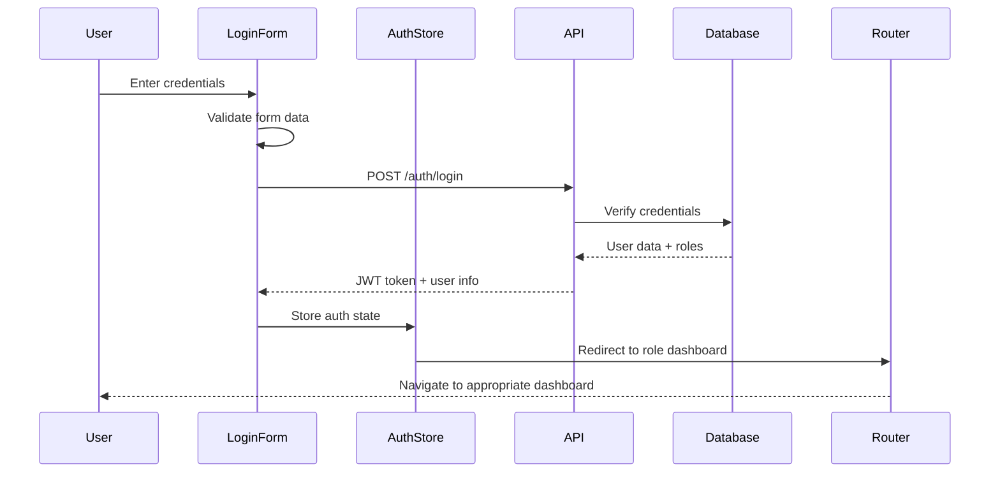
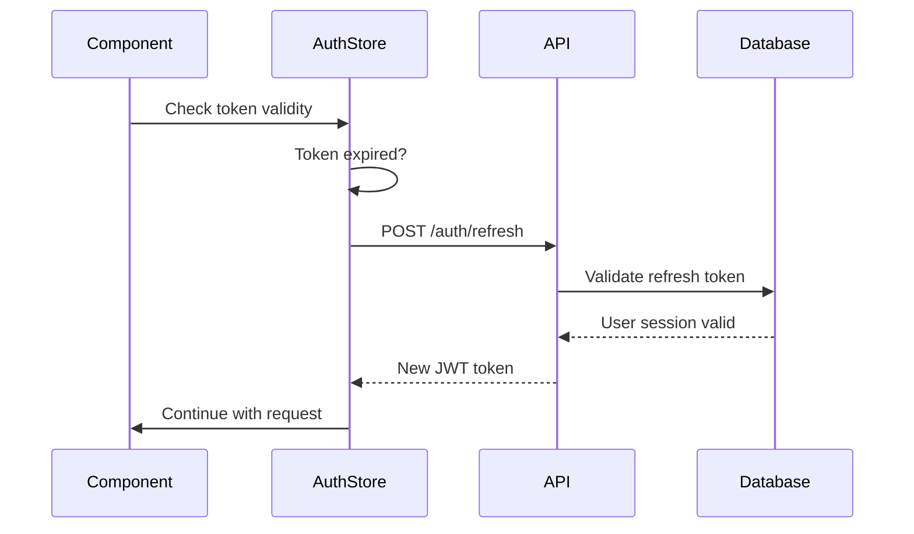
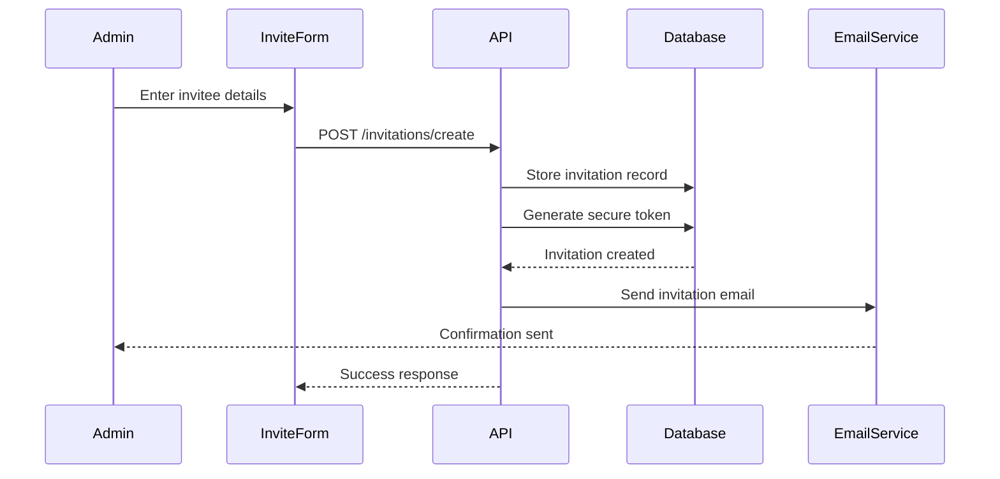
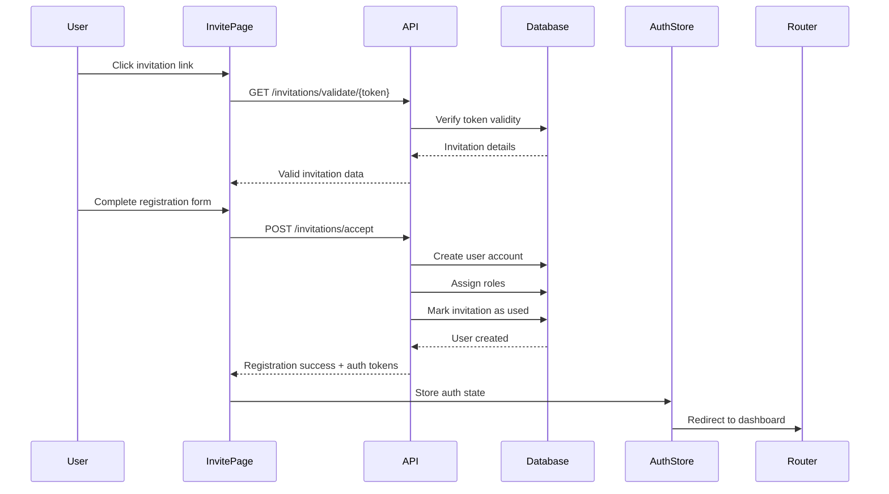
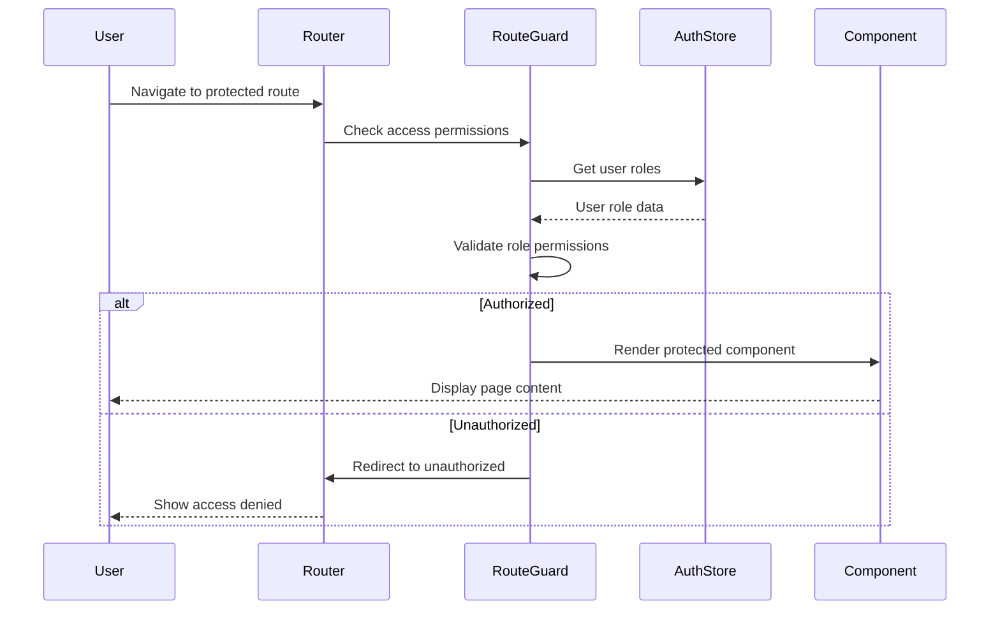
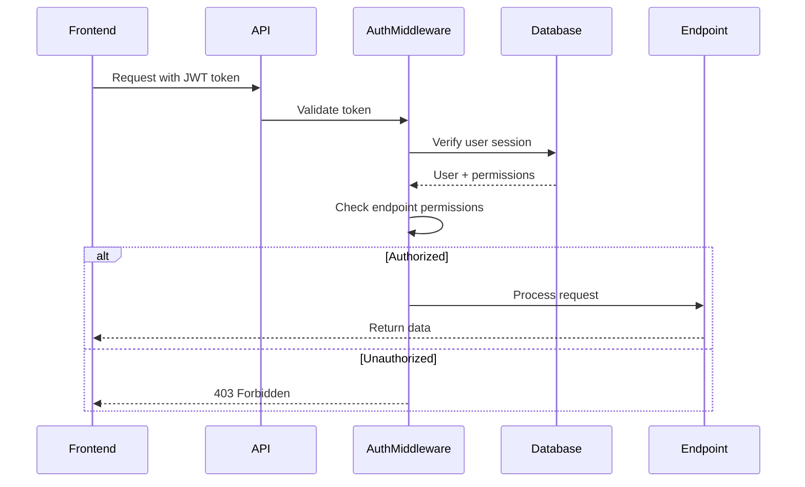
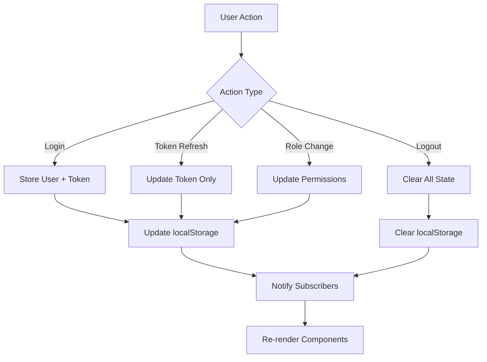
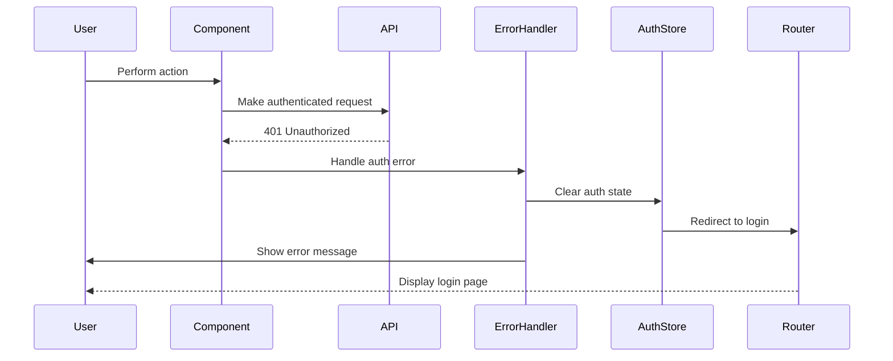
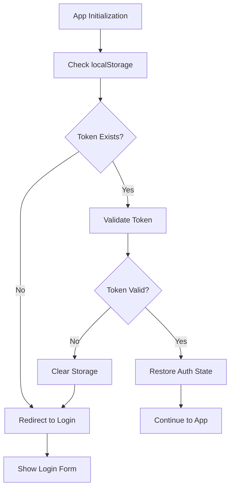

# Authentication & Authorization Data Flow

## Overview

This document outlines the data flow for authentication and authorization processes in the Safe Journey transport management system, including user login, invitation-based registration, role-based access control, and session management.

## Authentication Data Flows

### 1. User Login Flow



**Data Elements:**

- **Input**: Username/email, password
- **Processing**: Credential verification, token generation
- **Output**: JWT token, user profile, role information
- **Storage**: Auth store, secure cookies

### 2. Token Refresh Flow



**Data Elements:**

- **Input**: Refresh token
- **Processing**: Token validation, new token generation
- **Output**: New JWT token
- **Storage**: Updated auth store

## Invitation-Based Registration Flows

### 3. Create Invitation Flow



**Data Elements:**

- **Input**: Email, role, school_id (if applicable)
- **Processing**: Token generation, invitation record creation
- **Output**: Invitation token, email notification
- **Storage**: Invitation table, email queue

### 4. Accept Invitation Flow



**Data Elements:**

- **Input**: Invitation token, user registration data
- **Processing**: Token validation, user creation, role assignment
- **Output**: User account, JWT tokens, role assignments
- **Storage**: User table, auth store

### 5. School Admin Onboarding Flow

```mermaid
sequenceDiagram
    participant NewAdmin
    participant OnboardingForm
    parameter API
    participant Database
    participant SchoolStore
    participant AuthStore

    NewAdmin->>OnboardingForm: Complete school + user info
    OnboardingForm->>API: POST /onboarding/school-admin
    API->>Database: Create school record
    API->>Database: Create admin user
    API->>Database: Link user to school
    API->>Database: Mark invitation as used
    Database-->>API: Complete setup
    API-->>OnboardingForm: Success + auth tokens
    OnboardingForm->>SchoolStore: Store school data
    OnboardingForm->>AuthStore: Store auth state
    AuthStore->>Router: Redirect to admin dashboard
```

**Data Elements:**

- **Input**: School information, admin user details
- **Processing**: School creation, user creation, role assignment
- **Output**: School record, admin user, JWT tokens
- **Storage**: School table, user table, auth store

## Authorization Data Flows

### 6. Role-Based Route Protection



**Data Elements:**

- **Input**: Route path, user roles
- **Processing**: Permission validation
- **Output**: Access granted/denied
- **Storage**: Route configuration

### 7. API Authorization Flow



**Data Elements:**

- **Input**: JWT token, endpoint path
- **Processing**: Token validation, permission checking
- **Output**: API response or error
- **Storage**: User sessions, permission cache

## State Management Data Flow

### 8. Auth Store State Updates



**State Elements:**

- **user**: Current user information
- **token**: JWT authentication token
- **refreshToken**: Token refresh capability
- **permissions**: User role permissions
- **isAuthenticated**: Authentication status
- **isLoading**: Request processing state

## Error Handling Data Flow

### 9. Authentication Error Flow



**Error Types:**

- **401 Unauthorized**: Invalid or expired token
- **403 Forbidden**: Insufficient permissions
- **422 Validation Error**: Invalid registration data
- **429 Rate Limited**: Too many requests

## Data Persistence

### 10. Session Persistence Flow



**Persistence Elements:**

- **localStorage**: JWT token, refresh token
- **sessionStorage**: Temporary session data
- **Cookies**: Secure authentication cookies
- **Memory**: Runtime auth state

## Security Considerations

### Data Protection

- **Token Encryption**: JWT tokens are signed and optionally encrypted
- **Secure Transport**: All authentication data transmitted over HTTPS
- **Storage Security**: Sensitive data stored securely in httpOnly cookies
- **Input Validation**: All user inputs validated on client and server

### Privacy Measures

- **Data Minimization**: Only necessary user data collected
- **Consent Management**: User consent tracked for data processing
- **Audit Logging**: Authentication events logged for security monitoring
- **Data Retention**: User data retained according to privacy policies

## Performance Optimizations

### Caching Strategy

- **Token Caching**: JWT tokens cached for quick validation
- **Permission Caching**: User permissions cached to reduce database queries
- **Session Caching**: User sessions cached for improved performance
- **Route Caching**: Protected route configurations cached

### Lazy Loading

- **Component Loading**: Role-specific components loaded on demand
- **Permission Loading**: User permissions loaded as needed
- **State Hydration**: Auth state hydrated progressively
